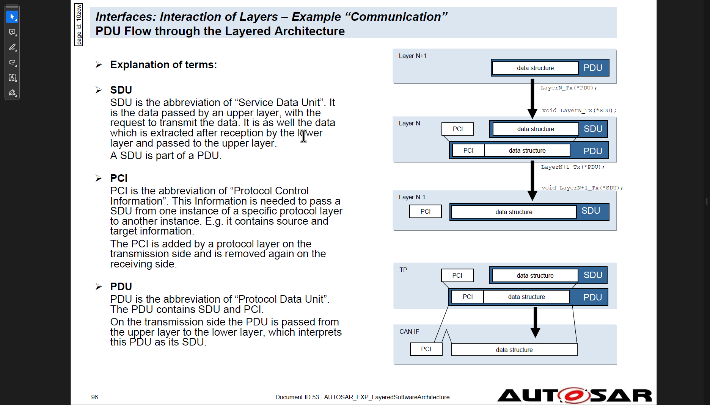
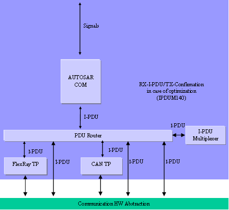
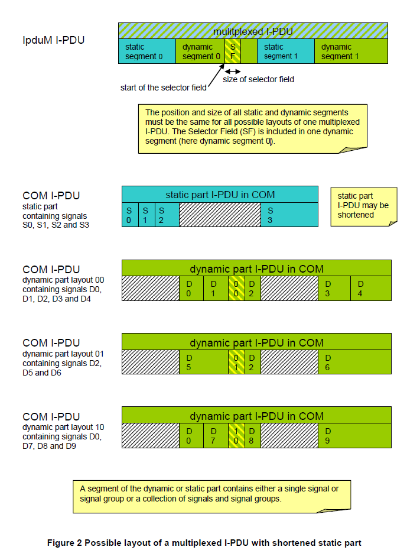
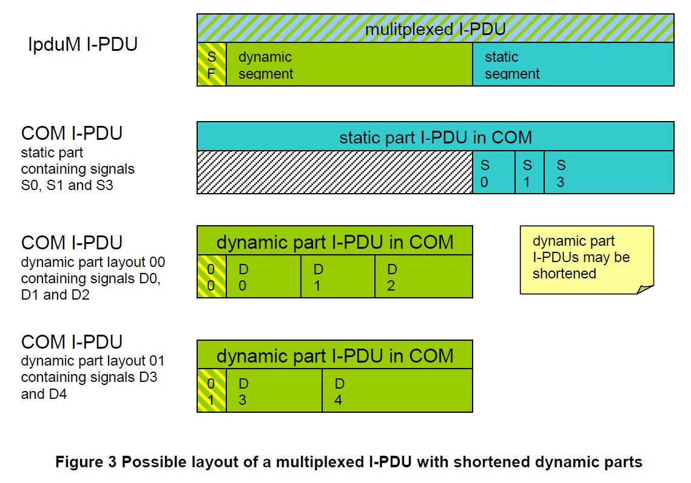

# Cornell Notes

## Topic: I-PDU Multiplexer IpduM

## Date: 15/09/2025

---

### Cue Column (Questions, Keywords, or Prompts)

---

### Notes Section (Main Notes)

**1. Introduction and functional overview**

- PDU multiplexing means using the same PCI (Protocol Control Information) of a PDU (Protocol Data Unit) with more than one **unique layout of its SDU** (Service Data Unit).
- A **selector field** is a piece of the SDU of the multiplexed PDU. It is used to distinguish the contents of the multiplexed PDUs from each other.

- Multiplexing of PDUs is currently known from CAN, but is not restricted to this communication system.
  - **On sender-side:** the I-PDU Multiplexer module is responsible to combine appropriate I-PDUs from COM to new, multiplexed I-PDUs and send them back to the PDU Router. 
  - **On receiver-side:** 
    - The I-PDU Multiplexer module is responsible to interpret the content of multiplexed I-PDUs
    - Provide COM with its appropriate separated I-PDUs taking into account the value of the **selector field**.

| Abbreviation / Acronym:   | Description:                                                                                     |
| ------------------------- | ------------------------------------------------------------------------------------------------ |
| COM I-PDU                 | I-PDU assembled in the COM module out of COM Signals                                             |
| contained I-PDU           | I-PDU assembled into or extracted from a Container PDU                                           |
| dynamic part              | see AUTOSAR_SRS_IPDUMultiplexer.pdf                                                              |
| instance of an I-PDU      | IpduM I-PDU with one specific layout and content                                                 |
| Instances of a Con-tainer | Instances of the same Container PDU                                                              |
| IpduM                     | I-PDU Multiplexer                                                                                |
| IpduM I-PDU               | I-PDU assembled in the IpduM module out of two COM I-PDUs                                        |
| multiplexed I-PDU         | see IpduM I-PDU                                                                                  |
| segment                   | The static or dynamic part may consist of more than one piece. These pieces are called segments. |
| selector field            | see AUTOSAR_SRS_IPDUMultiplexer.pdf                                                              |
| signal                    | see AUTOSAR_SWS_BSWGeneral.pdf                                                                   |
| signal group              | see AUTOSAR_SWS_BSWGeneral.pdf                                                                   |
| static part               | see AUTOSAR_SRS_IPDUMultiplexer.pdf                                                              |

**2. Constraints and assumptions**

  **2.1. Limitations**
  - For transmission of multiplexed I-PDUs, minimum delay time observation cannot be taken into account.
  - For transmission of container PDUs with static layout, minimum delay time cannot be ensured if two or more contained PDUs have each MDT configuration.

**3. Dependencies to other modules**
- The IpduM is arranged next to the PDU Router in the layered architecture of AUTOSAR

  

  **3.1. AUTOSAR OS**
  - The IpduM shall not directly access the AUTOSAR OS.

  **3.2. RTE (BSW Scheduler)**
  - The RTE includes the BSW-Scheduler.
  - The IpduM module relies on the **BSW-scheduler** calling:
    -  **IpduM_MainFunctionRx** at a period as configured in **IpduMRxTimeBase**
    -  **IpduM_MainFunctionTx** at a period as configured in **IpduMTxTimeBase**
  
  **3.3. PDU Router**
  - The functionality IpduM needs **from** the PDU Router:
    - Indication of incoming multiplexed or contained I-PDUs
    - Sending interface for outgoing I-PDUs (Container or Multiplexed PDUs)
    - Confirmation of I-PDUs which went out
  - The functionality provided by the IpduM module **for** the PDU Router module:
    - Indication interface for incoming I-PDUs, which are de-multiplexed and for in-coming Container-PDUs, which are to be disassembled
    - Sending interface for to be multiplexed I-PDUs and I-PDUs, which are to be assembled into a Container PDU
    - Confirmation interface for transmitted I-PDUs
  - The configuration of the PDU Router module (e.g. look-up tables) must be such that the I-PDUs, which belong to multiplexed I-PDUs and represent a static or a dynamic part of a multiplexed I-PDU, are routed to the IpduM module. These are:
    - I-PDUs, which belong to multiplexed I-PDUs and represent a static or a dy-namic part of a multiplexed I-PDU
    - I-PDUs, which consist of static and dynamic parts to be de-multiplexed
    - I-PDUs, which are to be assembled into a Container PDU
    - Container PDUs to be disassembled
  
  **3.4. COM**
  - The configuration of the IpduM module relies on a corresponding configuration of the AUTOSAR COM module. 
  - For each multiplexed I-PDU, there need to be different I-PDUs for the static part and each layout of the dynamic part. 
  - The IpduM further assumes that the correct selector field values are already contained in the COM’s modules I-PDU representing the dynamic parts.
  - The configuration of Container PDUs/ contained I-PDUs does not depend on the COM configuration.

**4. Functional Specification**

  **4.1. General**
  - There are two different approaches of multiplexing several I-PDUs into one resulting PDU being transferred on the bus:
    - **I-PDU Multiplexing:** means using the same I-PDU ID transferred from the PDU Router to the Communication Hardware Abstraction Layer with more than one unique layout of this I-PDU.
    - **Multiple PDU to Container Mapping:** means collecting several I-PDUs into one Container PDU. 
      - This Container PDU is then transferred via PduR as one (large) I-PDU. 
      - This way advantage of the larger frame sizes of newer bus systems can be taken, allowing an efficient usage of the bandwidth in combination with smaller I-PDU sizes (usually 8 bytes).

  **4.2. I-PDU Multiplexing**

  **Definitions and Layout:**
  - A multiplexed I-PDU consists of a static part and a dynamic part:
    - **Static part:** consists of zero or more signals or signal groups. 
    - **Dynamic part:** consists of the selector field and one or more signals or signal groups
      - The **dynamic part** of an I-PDU is comparable with a union of the programming language C. 
      - Depending on the value of the selector field inside the I-PDU, the actual layout of the I-PDU is selected.

  - The position of the static and the dynamic part are configurable per I-PDU. 
    - The static and the dynamic part can be subdivided into different segments.
    - Only one selector field can be defined for each multiplexed I-PDU. 
    - The value of the selector field defines how the content of the dynamic part of the I-PDU will be interpreted. 
    - The selector field has a configurable size between 1 and 16 contiguous bits and its position can be defined by configuration
  - Multiplexing of PDUs is originally known from CAN, but it is not restricted to this communication system. 
    - The IpduM is layered next to the PDU Router above the interface layer (Communication Hardware Abstraction) in the AUTOSAR layer architecture and therefore this feature could be used for all bus systems, which can be handled by the PDU Router, for example FlexRay.

  

  

  **General:**
  - There is one COM I-PDU for the static part and one COM I-PDU for each layout of the dynamic part of one multiplexed IpduM I-PDU, so the IpduM combines at most two I-PDUs of COM.
  - The IpduM module shall not set the selector field.
  - The IpduM module relies on the configuration of the COM module. 
    - For each dynamic layout, an I-PDU **needs to be configured in COM**. 
    - Such I-PDUs already have to contain the correct selector field value. 
    - The **selector field values in COM can be initialized by configuring them as signals** that are initialized with an init value but are never written after initialization.
  - The IpduM shall respect the **IpduMByteOrder** when interpreting the selector field value.
  - It shall be allowed to optimize the Rx- and Tx-Confirmation path from the IpduM module via the PDU Router module to the COM layer to call the COM API directly from the IpduM module without including the PDU Router. This shall be indicated by setting the published parameter IpduMRxDirectComInvocation to TRUE.
  - In case of the COM invocation, optimization as defined above **IpduM.c** needs to include **Com.h**.

  **Initialization:**
  - The IpduM module provides an initialization function **IpduM_Init** defined in [SWS_IpduM_00032]. This function initializes all internal global variables and the buffers of the IpduM I-PDUs.
  - The environment of the IpduM shall call **IpduM_Init** before calling any other function of the IpduM module.
  - The implementer has to ensure that **IPDUM_E_UNINIT** is returned **in development mode** in case an API function (except IpduM_MainFunctionTx, IpduM_MainFunctionRx and IpduM_GetVersionInfo) is called before the module is initialized.
  - For the I-PDU data transmission pathway through the IpduM module, a buffer is allocated inside the IpduM module. 
    - This buffer needs to be initialized because it might be transmitted before it has been fully populated with data by the COM module. 
    - The initialization data of this buffer is derived from the initial values of the COM module’s configuration as follows:
      - The IpduM shall initialize its **internal transmit buffers** with the configured pattern **IpduMIPduUnusedAreasDefault**.

---

### Summary Section (Summary of Notes)

[Insert a brief summary of the key ideas and takeaways]
