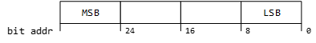
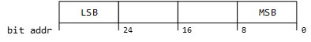

# Cornell Notes

## Topic: CALID CVN

## Date: 18/09/2025

---

### Cue Column (Questions, Keywords, or Prompts)

---

### Notes Section (Main Notes)

**1. Definition of Term:**

- CALID = Calibration ID = Kalibrierungs-Identifikation = Calibration identification
- CVN = Calibration Verification Number = Prüfsumme = Checksum

**2. CALID-CVN-Toolchain and Workflow**

**2.1. CALID-CVN-Toolchain Overview**

**2.2. CALID-CVN-Workflow**

| Step | Task                           | Description                                                                                                       | Role | Output                                                                                                                           |
| ---- | ------------------------------ | ----------------------------------------------------------------------------------------------------------------- | ---- | -------------------------------------------------------------------------------------------------------------------------------- |
| 1    | K-Matrix Analysis              | During K-Matrix update, PDUs are checked for new CALID-CVN-PDUs (Naming)                                          | Cupf | List new CALID-CVNs and their PDUs and signals                                                                                   |
| 2    | Signal port creation           | According to the Signals list, Signal ports are added in Signal-Database                                          | Cupf | Signal ports for CALID-CVN in Signal-Database                                                                                    |
| 3    | Signal Mapping configuration   | Signal mappings for the CALID-CVN-Signals are created in:  *SignalMappings-Sheet* `comscl_netmtrx_rbands.xlsx` | Cupf | Signal-Mappings in `comscl_netmtrx_rbands.xlsx`                                                                                  |
| 4    | CALID-CVN-Configuration        | CALID-CVN-Configuration is created/provided in:  Tab *CalldCvnConfiguration* in `comscl_netmtrx_rbands.xlsx`   | Cupf | CALID-CVN-Configuration in `comscl_netmtrx_rbands.xlsx`                                                                          |
| 5    | ConfigurationValues generation | EcuC-Configuration for CALID-CVN is generated by:  running `rba_nds_gen.pl`                                    | FnD  | `comscl_netmtrx_calidcvn_ecucvalues.arxml` `comscl_netmtrx_calidcvn_confdata.xml`                                             |
| 6    | check-in                       | EcuC-Configuration is checked-in in:  FC-ARB : `ComScl_NetMtrx`                                                | FnD  | FC-ARB : `ComScl_NetMtrx` with check-in: `comscl_netmtrx_calidcvn_ecucvalues.arxml` `comscl_netmtrx_calidcvn_confdata.xml` |
| 7    | SWB, Testing, …                | Further steps as per ProcLib                                                                                      | …    | Released BC                                                                                                                      |

**3. CALID-CVN Configuration**

**3.1. CALID-CVN-Configuration in `comscl_netmtrx_rbands.xlsx`**
- CALID-CVN-Configuration is done in tab "CalIdCvnConfiguration" in `comscl_netmtrx_rbands.xlsx`
- Configuration Tags:

| Tag                 | Description                                                                                                                                                                                                                                            |
| ------------------- | ------------------------------------------------------------------------------------------------------------------------------------------------------------------------------------------------------------------------------------------------------ |
| `CalIdCvn`          | Name of the CALID-CVN-ECU                                                                                                                                                                                                                              |
| `BusName`           | Name of the bus where the CALID-CVN-ECU is located – shall equal tag `NetworkName` in tab *Configuration*                                                                                                                                              |
| `CalId_Type`        | Type of the CALID. **Valid types:** - `split`: CALID is sent via 16 8-bit signals, distributed over 1 or more PDUs. Signals are numbered in ascending order 1–16.                                                                                |
| `CalId_PduCount`    | Count of CALID-PDUs. Usual are 1 or 2.                                                                                                                                                                                                                 |
| `CalId_Pdus`        | Name of the CALID-PDUs. **Valid syntax:** - **Single-PDU:** `<PduName>` - **Multiple-PDUs:** `<CommonName>_<X>` (… `<X>` placeholder for 1-digit running number)  `<CommonName>_<XX>` (… `<XX>` placeholder for 2-digit running number)    |
| `CalId_DataSignals` | Name of the CALID-Signals. **Valid syntax:** `<CommonName>_<XX>` (… `<XX>` placeholder for 2-digit running number)                                                                                                                                  |
| `Cvn_Type`          | Type of the CVN. **Valid types:** - `split`: CVN is sent via 4 8-bit signals. Signals are numbered in ascending order 1–4. - `atomic`: CVN is sent via 1 32-bit Signal.                                                                       |
| `Cvn_PduCount`      | Count of CVN-PDUs. Usual 1.                                                                                                                                                                                                                            |
| `Cvn_Pdus`          | Name of the CVN-PDU. **Valid syntax:** `<PduName>`                                                                                                                                                                                                  |
| `Cvn_DataSignals`   | Name of the CVN-Signals. **Valid syntax:** - **One Signal:** `<Signal_Name>` - **More Signals:** `<CommonName>_<X>` (… `<X>` placeholder for 1-digit running number) `<CommonName>_<XX>` (… `<XX>` placeholder for 2-digit running number) |
| `Cvn_VldSignal`     | Name of the CVN-Valid (Vld)-Signal. If there is no CVN-Valid-Signal, value `none` must be entered.                                                                                                                                                  |

- Signalmappings for CalId/Cvn ports must be provided in Signal Mappings Sheet
- Please consider: Port for CvnVld Signal must not have name "`Com_flg<CalId>CvnVld`". An interface with the same name is expected by the DiaBas module. So the name of the port mapping of the CvnVld Signal must be changed slightly. E.g. In above example the signalport name for CvnVld Signal is "ComFlgEKATCvnVldPort". Ist recommended to use same or similar nomenclature.

**3.2. CALID-CVN-Configuration-Example**
- E.g. EKAT Calid on Motor_SUBCAN of E3P:

  - CalId PDUs: EKAT_CALID_01, EKAT_CALID_02
  - CalId Signals:
    - EKAT_CALID_01: EKAT_CALID_Index_01 — EKAT_CALID_Index_07
    - EKAT_CALID_02: EKAT_CALID_Index_08 — EKAT_CALID_Index_16
  - Cvn PDU: EKAT_CVN
  - Cvn Signals:EKAT_CVN_Byte_1 — EKAT_CVN_Byte_4, EKAT_CVN_VLD

**4. CALID-CVN-Configuration for DiaBas**

**Implementation of CVN / CALID**
- If a CALID and/or CVN is provided by a sensor within one or more PDUs then:
  - For each PDU only one DSQ shall be configured in PL / FRM --> DSQ_ComdataXXX (XXX = PDU name without "_"; e.g for SCR_DEF2_CAL_ID2 = DSQ_ComdataSCRDEF2CALID2)
  - Only for FR: for each CALID and / or CVN NO signal signal status is needed, because it will not be used!

- The following configuration parameters need to be provided to the ASW as per the DiaBas programmer's guide:

| Com-Interface Name   | Com-Interface Meaning                                                                                                                                                                                        | ASW Configuration Tag            | ASW Configuration Parameter Explanation                                                                                                                                                                                                                                           |
| -------------------- | ------------------------------------------------------------------------------------------------------------------------------------------------------------------------------------------------------------ | -------------------------------- | --------------------------------------------------------------------------------------------------------------------------------------------------------------------------------------------------------------------------------------------------------------------------------- |
| `Com_stYYYCalid[X]`  | **CALID array** *The ASW expects the complete CALID to be provided within one array (even if more than one PDU is used for receiving or multiplexed within one PDU).*                                     | `&lt;CALID_REF_VALUE&gt;`        | 16 byte array message containing the Cal ID from external ECU / module.  *Hint:* The message array has to be provided in the external tester format. E.g. `Message_array[0] = DATA A of Cal ID to tester`, `Message_array[1] = DATA B … Message_array[15] = DATA P of Cal ID`. |
| `Com_flgYYYCalidVld` | **CALID valid bit** *Provides information on the validity of the CALID, i.e. whether the complete CALID was received on the bus.*                                                                         | `&lt;CALID_REF_STATUS_VALUE&gt;` | Message containing the validity of Cal ID from external ECU / module.                                                                                                                                                                                                             |
| `Com_flgYYYCalidErr` | **CALID error bit** *Provides information on the error status of the CALID, i.e. whether there has been a bus transmission failure.*                                                                      | `&lt;CALID_REF_ERROR_VALUE&gt;`  | Message containing the error status of the Cal ID from external ECU / module.                                                                                                                                                                                                     |
| `Com_nrCvnYYY[X]`    | **CVN array** *The ASW expects the complete CVN to be provided within one array* (Currently all implemented CVNs have 4 byte –> programmers guide from DiaBas).                                        | `&lt;CVN_REF_VALUE&gt;`          | 4 byte array message containing the CVN from external ECU / module. *Hint:* The message array has to be provided in the external tester format. E.g. `Message_array[0] = DATA A of CVN … Message_array[3] = DATA D of CVN`.                                                    |
| `Com_flgYYYCvnVld`   | **CVN valid bit** *Provides information on the validity of the CVN, i.e. whether the complete CVN was received on the bus (for some CVN, a separate valid bus signal is available e.g. `BOOST_CVN_VLD`).* | `&lt;CVN_REF_STATUS_VALUE&gt;`   | Message containing the validity of CVN from external ECU / module.                                                                                                                                                                                                                |
| `Com_flgYYYCvnQly`   | **CVN quality bit** *Provides information on the quality of the received CVN, i.e. whether the content of the received CVN is proper.*                                                                    | `&lt;CVN_REF_STATUS2_VALUE&gt;`  | Message containing the quality of CVN from external ECU / module.                                                                                                                                                                                                                 |
| `Com_flgYYYCvnErr`   | **CVN error bit** *Provides information on the error status of the CVN, i.e. whether there has been a bus transmission failure.*                                                                          | `&lt;CVN_REF_ERROR_VALUE&gt;`    | Message containing the error status of the CVN from external ECU / module.                                                                                                                                                                                                        |

- **YYY** = PDU name without "_" and without the corresponding PDU number (e.g. for SCR DEF2 two PDUs are used SCR_DEF2_CAL_ID1 and SCR_DEF2_CAL_ID2 --> Com_stSCRDEF2CALIDCalid[x])
- A reference implementation can be seen in SnsrECU_Boost 1.2.0;0
- For reference see: DOCMISC : diabas_programmersguide_pdf / 30000.9.0; 0

**5. CALID-CVN-Testing**

**5.1. Definition of Term**

**CALID:**
- The CALID consists of 16 bytes, for easier handling they are called DATA A — P.
- For correct display of the CALID on the tester, the tester expects the CALID as an uint8 array: Com_st<ecu-name>Calid[].
- The CALID needs to be prepared in the array in that format:
  |        |                           |
  | ------ | ------------------------- |
  | DATA A | Com_st<ecu-name>Calid[0]  |
  | DATA B | Com_st<ecu-name>Calid[1]  |
  | DATA C | Com_st<ecu-name>Calid[2]  |
  | DATA D | Com_st<ecu-name>Calid[3]  |
  | DATA E | Com_st<ecu-name>Calid[4]  |
  | DATA F | Com_st<ecu-name>Calid[5]  |
  | DATA G | Com_st<ecu-name>Calid[6]  |
  | DATA H | Com_st<ecu-name>Calid[7]  |
  | DATA I | Com_st<ecu-name>Calid[8]  |
  | DATA J | Com_st<ecu-name>Calid[9]  |
  | DATA K | Com_st<ecu-name>Calid[10] |
  | DATA L | Com_st<ecu-name>Calid[11] |
  | DATA M | Com_st<ecu-name>Calid[12] |
  | DATA N | Com_st<ecu-name>Calid[13] |
  | DATA O | Com_st<ecu-name>Calid[14] |
  | DATA P | Com_st<ecu-name>Calid[15] |

**CVN:**
- The CVN consists of 4 bytes, for easier handling the are called: DATA A – D. 
- For correct display of the CVN on the tester, the tester expects the CAN provided as uint8 array: Com_nrCvn<ecu-name>[].
- The CVN needs to be prepared in the array in that format:
  |        |                        |
  | ------ | ---------------------- |
  | DATA A | Com_nrCvn<ecu-name>[0] |
  | DATA B | Com_nrCvn<ecu-name>[1] |
  | DATA C | Com_nrCvn<ecu-name>[2] |
  | DATA D | Com_nrCvn<ecu-name>[3] |

**Preconditions:**
- The CALID- and CVN-PDUs need to be enabled: Bit 0 
- The CALID and CVN to be displayed on the tester needs to be calibrated in I15031_srv9_CALIDCVN_Seq_CA and I15031_CalidCvn_SrvTstr_Seq_CA
- The CVN in the tester output has to be read from left to right, beginning with DATA A - B - C - D (e.g. 0A 0B 0C 0D in hex)
- The CALID has to be read equal in the tester, to the CVN, starting with DATA A --> P
- To provide the tester the CVN in a proper format we also have to know how DATA A-D is provided on the bus. According to our understanding the CVN is written on the bus signals:
  - CVN provided in one PDU with 4x 1byte bus signals (e.g. CCU- and Boost-CVN)
    - CCU_CVN_Byte_1 [Byte 5 Bit [8 <— 0]]  --> DATA A
    - CCU_CVN_Byte_2 [Byte 6 Bit [8 <— 0]]  --> DATA B
    - CCU_CVN_Byte_3 [Byte 7 Bit [8 <— 0]]  --> DATA C
    - CCU_CVN_Byte_4 [Byte 8 Bit [8 <— 0]]  --> DATA D
  - CVN provided in one PDU with 1x 32bit (4Byte) bus signal (e.g. GW-CVN)
    - GW_CVN [Byte 5 Bit [8 <— 0]]  --> DATA D
    - GW_CVN [Byte 6 Bit [8 <— 0]]  --> DATA C
    - GW_CVN [Byte 7 Bit [8 <— 0]]  --> DATA B
    - GW_CVN [Byte 8 Bit [8 <— 0]]  --> DATA A
- CVN / CALID have always to be tested with Diagra / Tester!! Only with INCA, the testing is not enough
- CVN / CALID have always to be tested for IFX and JDP to verify the proper output and endianness
- Before testing take care that the CVN / CALID is proper configured in your test PVER
  - check CVN / CALID config in I15031_srv9_confdata.xml
  - proper application of I15031_srv9_CALIDCVN_Seq_CA and I15031_CalidCvn_SrvTstr_Seq_CA
  - take care that necessary PDUs are activated / available in ComVeh

**6. Little Endian - Big Endian**

- **Little Endian (LE) / Big Endian (BE) explanation. (examples given for a 32 bit system).**
  - Endianness describes in which Byte order Words are stored in the memory.
  - In a 32 bit system, a Word is 32 bits long and consists of 4 Bytes.
  - Little Endian (LE) means, the Least Significant Byte (LSB) of a Word is stored at the lowest memory address of that Word.

      
  - Big Endian (BE) means, the Most Significant Byte (MSB) of a Word is stored at the lowest memory address of that Word.
      
      
  - The bit order inside a Byte, is not effected by endianness and stays the same.
  - E.g. 32 bit Word AA BB CC DDh

- When red in that representation, the leftmost number is the most significant --> MSB = AAh
- The rightmost number is the lest significant --> LSB = DDh
  - Mem storage for LE:
  
    
  - Mem storage for BE:

    

- A CVN number is a 32 bit number divided in the 4 8-bit blocks A,B,C,D.
- Those blocks are displayed in the Tester Software in the format A - B - C - D.
- In that nomenclature, Block A is the MSB of the CVN and Block D is the LSB.
- The CVN is provided to the DiaBas service via a Byte array with 4 Element: Com_nrCVN[0] - Com_nrCVN[3]
- Array element 0 gest mapped to the display cell A and element 3 gets mapped to the display cell D.
- When the CVN is sent via 4 separate 8-bit signals on the bus, endianness in the ECU is irrelevant and  each byte can be mapped separately to the array elements according to their naming.
- When the CVN is sent via 1 32-bit signal, the 32-bit memory representation of the signal needs to be divided into 4 8-bit blocks and mapped to the array elements according to the endianness of the system.
- Based on the Tester Display in the format A - B - C - D, Com_nrCVN[0] must hold the MSB of the 32-bit bus signal and Com_nrCVN[3] must hold the LSB of the 32.bit bus signal.
- E.g. CVN = 33 22 11 00h and is transmitted via a 32-bit bus signal holding value 33 22 11 00h. CVN needs to be displayed in the Tester in the Form 33 -22 - 11 - 00. The mapping can be shown easily in a diagramm:

    

    

- MSB path is marked red, LSB path is marked green.
  - IFX CPUs are LE.
  - JDP CPUs are BE.

---

### Summary Section (Summary of Notes)

[Insert a brief summary of the key ideas and takeaways]
