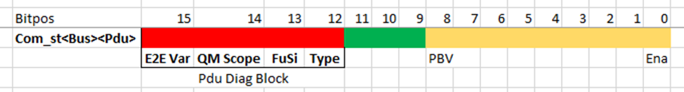
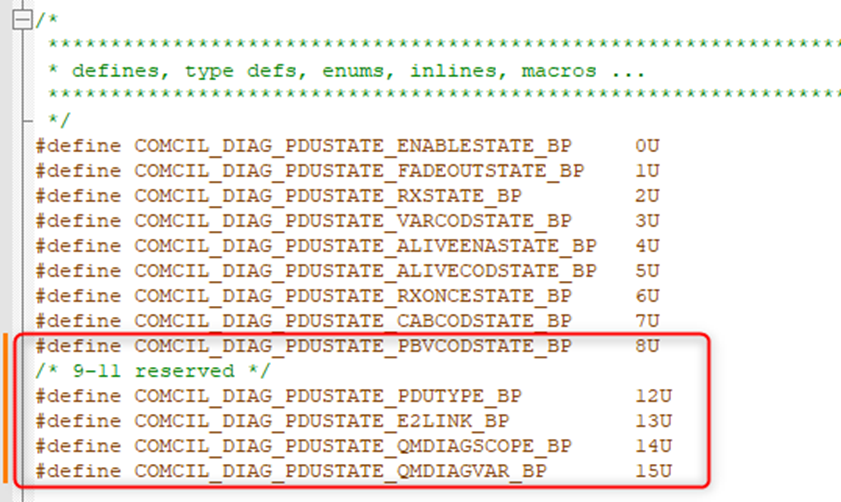
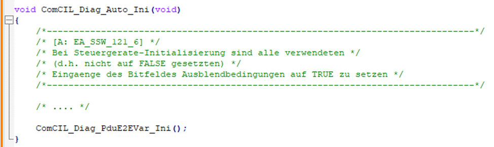
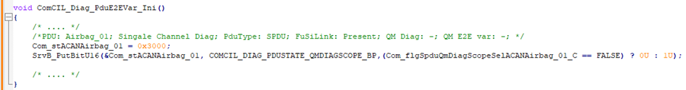

# Cornell Notes

## Topic: Dual Channel

## Date: 12/09/2025

---

### Cue Column (Questions, Keywords, or Prompts)

---

### Notes Section (Main Notes)

**1. Introduction**

- PDU diagnosis for Rx-PDUs are implemented differently for PDUs which contain only QM-data or also contain FuSi-relevant data.
  - PDUs which contain only QM-data
  - PDUs which contain only QM-data + FuSi-relevant data.

- **Diagnosis for PDUs with pure QM data are done in level 1 (E1)** within the ComVeh package. 
- **For PDUs with FuSi relevant data, a E2E-Status from level 2 (E2)** is provided to ComVeh, from which the final diagnosis state is derived and triggers the fault memory entry and replacement reactions.
- If a PDU is FuSi relevant or not is currently derived from the E2E attributes in the K-matrix (**presence of BSZ, CS signals** for the nodes Motor_konv or Motor_Hybrid).

- Currently **variant-handling** for project specific PDUs is restricted to deactivation of PDUs via application (e.g. hybrid specific PDUs in conventional projects). In case of deactivation the E2E state from E2 still needs to be provided.

- In newer versions of MQBevo/MQBw_Baseline specifications, it is possible that PDUs need to be processed over all projects but the FuSi-relevancy differs from project to project. 
- **This causes that the E2E status from E2 does not get provided in projects with no FuSi-relevancy** and the variant-handling based on E2E attributes in the K-matrix (presence of BZ, CRC) is no longer sufficient.

**2. Target behavior**

- The variant-handling of FuSi-relevancy for CAN-PDU diagnosis in ComVeh shall be extended. It shall not only be based on the K-matrix. 
- During PVER-creation (BCT-build):
  - A tag delivered from E2 shall be checked if a E2E status is provide from E2. 
  - Is the reception of CRC and BZ signals marked for given PDU
  - Is the presence of the E2 E2E status tagged
  
  Then the PDU shall be considered as FuSi relevant, means the **E2E-Status** gets considered by ComVeh.

- Otherwise, **no E2E Status shall be expected from E2 and no open Interfaces shall be present in the ComVeh package**. 
- In that case:
  - Only QM diagnosis shall be done by ComVeh. 
    - This QM diagnosis shall be expanded to provide an application label for each pdu to enable or disable PLAUS (CRC + BZ) diagnosis. 
    - Neutral application shall be, that if CRC/BZ are marked for reception that Timeout and **PLAUS (Checksum + Counter)** diagnosis shall be performed in E1 within ComVeh.

The PVER documentation shall be extended to **mark which E2E variant is configured for each PDU**

**3. Definition**

- **SPDU**: safety PDU (PDU with CRC/BZ singals in K-Matrix)
- **E2-link**: connection between E2 / E1. 
  - Is being indicated via tag and can be red out during BCT. 
  - If E2 link is present, E2 **E2E status** gest provide and needs to considered in E1.
- **Diagnoses Modes as per Buseigendiagnose 2.0 (Self-diagnosis of the bus):**
  - **Single Channel:** Applicable only for SPDUs. 
    - SPDU get diagnosed by E2 and final result gets provided to E1. 
    - Error Reporting is handled in E1
  - **Dual Channel:** Applicable only for SPDUs. 
    - SPDU **gets not** diagnosed by E2 and E2 **does not** provide final result to E1. 
    - E1 needs to perform **To** (Time out) and/or **Plaus (Checksum + Counter)** diagnoses on its own.

**4. Implementation of Application label for E1 diagnosis**
- An **application label** shall be provided for each SPDU. This label decides in case of:
  - **Single Channel Mode:** This label has no effect
  - **Dual Channel mode:**
    - If E1 needs to perform:
      - (**TO (Time out)** + **PLAUS (Checksum + Counter)**) diagnosis (default)
      - Only TO diagnosis via debounce counter.
    - This **application label** shall be created for all SPDUs, independent of Diagnoses Modes  
    - **Default application** is to perform (**TO (Time out)** + **PLAUS (Checksum + Counter)**) Diagnoses in E1.
    - This label shall not be created for NSPDUs (Non-safety PDUs)

*Remark: Application is provided by the project. By creating this configuration label for all SPDUs the project can keep the application constant and refer for testing to the “static application” process.*
- **Label definition:**

  - bool Com_swtSpduQmDiagScopeSel< Bus >< Pdu >_C -> Abbriviation as per abrriviation list
  - **Description:** Describes the Diagnosis scope in E1 for given safety PDU. This calibration has no effect if E2 diagnosis is present for given PDU. Possible values: 
    - FALSE: Time out only
    - TRUE: Time out + Plaus (Checksum + Counter)
- **Exporting FC:** ComScl_MonPduErr

**5. Changes FC: ComCIL_Diag**

- In PDU Status Variable Com_st< Bus >< Pdu > information regarding Diagnosis concept/type shall be added
- Com_st< Bus >< Pdu > is:
  - An uint16 with the first 9 bits already in use.
  - Bits 12-15 shall be used for Pdu Diangosis information. 
  - Bits 9-11 are reserved for further use. Bit assignment is shown in following picture:
    
- Bit allocation:
    | Bit Pos   | Description                   | Values                                |
    |-----------|-------------------------------|---------------------------------------|
    | 12        | PDU type                      | 0 = NSPDU                             |
    |           |                               | 1 = SPDU                              |
    | 13        | FuSi relevancy / Fusi link    | 0 = FuSi/E2 link NOT present          |
    |           |                               | 1 = FuSi/E2 link present              |
    | 14        | QM diagnosis scope            | 0 = TO only                           |
    |           |                               | 1 = TO + PLAUS (Checksum + Counter)   |
    | 15        | QM E2E variant                | 0 = E2E basic (counter)               |
    |           |                               | 1 = E2E Standard (FiFo)               |

- Define those Bit Positions in **comcil_diag_auto_function.h**:
    

- With this Bits following valid states are possible:

    | Bit Value | State                                                                         |
    |----------|--------------------------------------------------------------------------------|
    | 0000b    | Classic NSPDU as defined in FB NSPDUErr (To Deb, E2E Var irrelevant)           |
    | 0001b    | Dual Channel with pure TO Deb in QM (NSPDUErr To Deb as simplified E2E Basic)  |
    | 0011b    | Single Channel (QM Var, E2E Var irrelevant)                                    |
    | 0101b    | Dual Channel with PLAUS Diag as per E2E Basic (Counter)                        |
    | 1000b    | NSPDU with FiFo Debouncing (MQB classic)                                       |
    | 1101b    | Dual Channel with PLAUS Diag as per E2E Standard (FiFo, SPDU in MQB classic)   |

- Those 4 Bits shall be set during Initialization (ComCIL_Diag_Auto_Ini) and never be changed during runtime to ensure consistent Diagnosis behavior.
  - For that purpose an Ini function for setting Pdu E2E Var shall be created: **void ComCIL_Diag_PduE2EVar_Ini()**
  - This function shall be called within ComCIL_Diag_Auto_Ini() and no where else
  - In ComCIL_Diag_PduE2EVar_Ini initialization of all Com_st< Bus >< Pdu > Vars shall be done (for all Pdus on all Busses separated per bus)
  - Information regarding Bits 12, 13 and 15 are present at BCT time and setting of those bits shall be done via value assignment. Possible valid values can be taken from table above.
    - Value 0000h -> NSPDU with TO debouncing
    - Value 0300h -> SPDU with FuSi Link  Single Channel
    - Value 8000h -> NSPDU with FiFo Debouncing (MQB)
    - Value 1000h -> SPDU without FUSI Link  Dual Channel with E2E Basic (TO or PLAUS)
    - Value 9000h -> SPDU without FUSI Link  Dual Channel with E2E Standard (MQB)
  - For selection of those values use extensions described in chapter 3 and shall be done during BCT
  - Information regarding bit 14 gets retrieved from Com_swtSpduQmDiagScopeSel<Bus><Pdu>_C and needs to be set via PutBit
  - **Example code:**
    
    
- Get Functions needs to be implemented to retrieve the information
    - Get Functions shall be added in comcil_diag_auto_getpdustatus.h
    - Get functions shall be added and formatted as per coding style in comcil_diag_auto_getpdustatus.h
    - List of Functions:
        - ComCIL_Diag_GetPduDiagType_PduType_< Bus >__< Pdu >()
        - ComCIL_Diag_GetPduDiagType_E2Link_< Bus >__< Pdu >()
        - ComCIL_Diag_GetPduDiagType_QmDiagScope_< Bus >__< Pdu >()
        - ComCIL_Diag_GetPduDiagType_QmDiagVar_< Bus >__< Pdu >()

---

### Summary Section (Summary of Notes)

[Insert a brief summary of the key ideas and takeaways]
