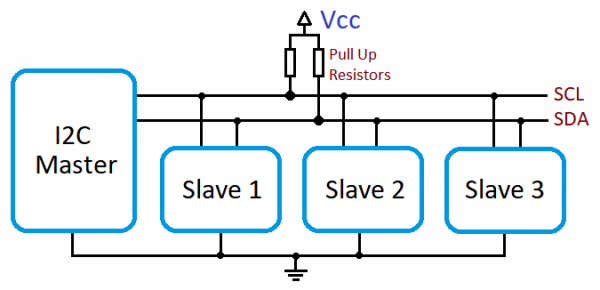
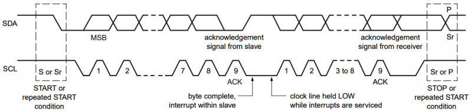
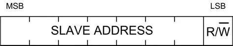

# I2C

## Topic: Overview

## Date: 31/08/2025 

---

### Cue Column (Questions, Keywords, or Prompts)
- EEPROM is a device?
- How to configure Clock Stretching?
- What is RTCs?
- Detail about **Repeat Start Condition**?

---

### Notes Section (Main Notes)

**1. I2C Protocol**

- I²C or I2C is an abbreviation of Inter-Integrated Circuit, a serial communication protocol made by Philips Semiconductor (now it is NXP Semiconductor). It is created with an intention of communication between chips reside on the same Printed Circuit Board (PCB). It is commonly usually used to interface slow speed ICs to a microprocessor or a microcontroller. It is a master-slave protocol, usually a processor or microcontroller is the master and other chips like RTC, Temperature Sensor, EEPROM will be the slave. We can have multiple masters and multiple slaves in the same I2C bus. Hence it is a multi-master, multi-slave protocol.

- I2C is quite popular at lower data rates due to its capability to perform communication between multiple devices utilizing only two wires.
- In fact, we have a limit on the number of devices that we can connect to an I2C. The ideal value for the number of devices is 128. 
- The functionality depends on:
  - Line **capacitance** (điện dung): need to keep it at standard level
  - Add current drivers
  - Schmitt trigger circuits
  - Twisted wires: to **supress** (giảm) the noise
- If you plan to add more than 3 devices using I2C, you need to refer to the specification sheet and the accordingly add components to match the electrical parameters

**2. I2C Interface**

- It needs only two wires for exchanging data and ground as the reference.
  - SDA – Serial Data
  - SCL – Serial Clock
  - GND – Ground

  

**3. I2C Hardware**
- Devices on an I2C bus is always a master or a slave.

  **Master:**

  - Master is the device which always initiates a communication and drives the clock line (SCL). Usually a microcontroller or microprocessor acts a master which needs to read data from or write data to slave peripherals.

  **Slave:**
  - Slave devices are always responds to master and won’t initiate any communication by itself. Usually devices like **EEPROM**, LCDs, RTCs acts as a slave device. Each slave device will have a **unique address** such that master can request data from or write data to it.

**4. I2C Protocol**
- I2C protocol is more complex than UART or SPI protocols as it using only 2 lines (one for clock and one for data) for to and from communication. But usually we don’t need to worry about it as in most of the devices hardware itself will take care of these things.

- Always a master device takes ownership of the bus at a time and initiate data transfer.

**4.1 Mode**

- Synchronous
- Multi-master
- Multi-slave
- There are multiple modes that I2C supports depending on the transmission rate requirement
  - **Standard mode:** 100 kHz SCL frequency, transferring data between devices at 100 kbit/sec
  - **Fast mode:** 400 kHz SCL frequency, transferring data between the controller and peripherals at 400 kbit/sec
  - **Fast mode plus:** 1 MHz SCL frequency, transferring data between the controller and peripherals at 1 Mbit/sec
  - **High-speed mode:** Up to 3.4 MHz SCL frequency, transferring data between the controller and peripherals at up to 3.4 Mbit/sec
  - **Ultra-fast mode:** 5 MHz SCL frequency, though data transmission is **unidirectional** (một chiều) only.

- We have two variations in I2C protocol. We could either work on **7-bit** addressing or **10-bit** addressing.
- With the growing increase in interfacing sensores in embedded systems, 7-bit addressing started to reach its limit, so the need **arose** (nảy sinh) to increase addressing **capability** (khả năng).

**4.2. Start Condition**
- I2C start condition is issued by a master device to give a notice to all slave devices that the communication is about to start. Thus start condition triggers all slave devices to listen to the data in the bus. 
- To issue start condition, the master device **pulls SDA low and leaves SCL high**. 
- In the case of multi-master I2C there is a possibility that 2 masters wish to take ownership of the bus at the same time. In these cases, the device which **pull down SDA first** gains the control of the bus.

**4.3. Address Frame**

- Address frame is always send just after the first start condition during every communication sequence. 
- In this master devices specifies the address of the slave device to which the master wants to communicate. There are basically 2 types of addressing 7-bit addressing and 10-bit addressing. In the 7-bit addressing mode, master sends address first (MSB first) followed by read/write (R/W) indicating bit (0 => Write, 1 => Read).

- **7-bit addressing**

  - With **7-bit** addressing, we are allowed to interface up to 128 devices, though this depends on electrical parameters as well as the distance used for communication.
  - The 7-bit addressing indicates the address of a slave, and the last bit (8th bit) represents the type of operations
    - **1:** Write operation
    - **0:** Read operation

    

- **10-bit addressing**

  - Instead of sending **a single byte** of data to a slave, we send **2 bytes of data**.
  - Here we have one byte followed by a second byte. Similar to 7-bit addressing, we send the start of communication. In the first byte, **the first five bits are all 1**.
  - Followed by 2 MSB address bits (bit 9 and bit 8) and the type of operation stored in the next bit indicates Read/Write operation which is similar to 7-bit addressing.
  - Then we wait for an acknowledgement from the slave.
  - Once we receive acknowledgement, we send the next byte, where all bits consist of the address. If we analyze bit 0 to bit 9, we will get 10-bit address. These are **fixed values** that we add to our frame,

      

**4.4 Data Frames**
- Data frame(s) are transmitted just after the address frame. It can be send from master to slave OR from slave to master depending on the above R/W bit through SDA line. 
- The master will continue generating required clock signals. Devices can send one or more than one data frame as per the requirements.

**4.5. Stop Condition**
- Master device will generate stop condition once all data frames has been sent/received. 
- As per I2C standards, STOP condition is defined as a LOW to HIGH transition on SDA line after a LOW to HIGH transition on SCL, with SCL HIGH. So, **SDA should not change status when SCL is HIGH to avoid false stop condition.**

**4.6. Repeated Start Condition**

- During an I2C communication, sometimes a master wants to send a specific command to a slave device and read back response right away. In this situation there is a possibility that another master (in case of multi-master bus) takes the control of the bus. To avoid these conditions I2C protocol defines **repeated start condition.**

- In normal cases I2C master will send start condition, address + R/W bit, send or receive any number of bytes and mark the end by a stop condition. During repeated start condition, master will send START CONDITION instead of stop condition and will keep the control over the bus. 
- Master can send any number of start condition using this method. **Irrespective of** (Bất kể) the number of start conditions, transfer must be end by exactly one stop condition

**4.7. Clock Stretching**
- We have seen that master device determines the clock speed in I2C communication. This avoid the need of synchronizing master and slave exactly to a predefined baudrate. But there can be some situations when I2C slave device is not able to cooperate with clock signals given by master. Clock stretching is the mechanism used to slow down master device for slave device to complete it’s operation.

- I2C slave device is allowed to hold down the clock signal when it needs master to slow down on the 9th clock of every data transfer before the ACK stage.

**4.8. Acknowledge (ACK) and Not Acknowledge (NACK)**
- Each byte of data in I2C communication includes an additional bit known as ACK bit. This bit provides a **provision** (sự cung cấp) for the receiver to send a signal to transmitter that the byte was successfully received and ready to accept another byte.

---

### Summary Section (Summary of Notes)
