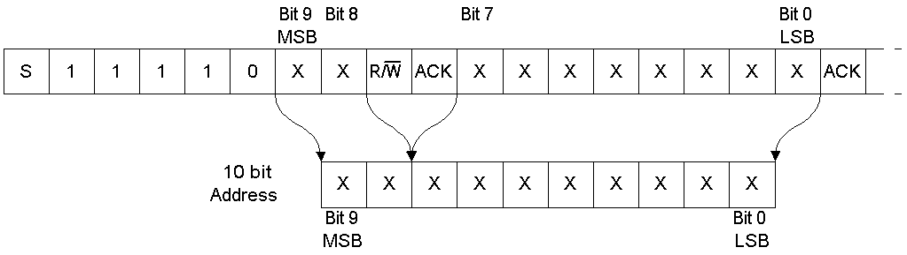

# I2C

## Topic: Overview

## Date: 31/08/2025 

---

### Cue Column (Questions, Keywords, or Prompts)

---

### Notes Section (Main Notes)

**1. I2C Protocol**

- I2C is quite popular at lower data rates due to its capability to perform communication between multiple devices utilizing only two wires.
- In fact, we have a limit on the number of devices that we can connect to an I2C. The ideal value for the number of devices is 128. 
- The functionality depends on:
  - Line capacitance: need to keep it at standard level
  - Add current drivers
  - Schimitt trigger circuits
  - Twisted wires: to supress the noise
- If you plan to add more than 3 devices using I2C, you need to refer to the specification sheet and the accordingly add components to match the electrical parameters

**2. Mode**

- Synchronous
- Multi-master
- Multi-slave
- There are multiple modes that I2C supports depending on the transmission rate requirement
  - **Standard mode:** 100 kHz SCL frequency, transferring data between devices at 100 kbit/sec
  - **Fast mode:** 400 kHz SCL frequency, transferring data between the controller and peripherals at 400 kbit/sec
  - **Fast mode plus:** 1 MHz SCL frequency, transferring data between the controller and peripherals at 1 Mbit/sec
  - **High-speed mode:** Up to 3.4 MHz SCL frequency, transferring data between the controller and peripherals at up to 3.4 Mbit/sec
  - **Ultra-fast mode:** 5 MHz SCL frequency, though data transmission is unidirectional only.

- We have two variations in I2C protocol. We could either work on 7-bit addressing or 10-bit addressing.
- With the growing increase in interfacing sensores in embedded systems, 7-bit addressing started to reach its limit, so the need arose to increase addressing capability.

**7-bit addressing**

  - With 7-bit addressing, we are allowed to interface up to 128 devices, though this depends on electrical parameters as well as the distance used for communication.
  - The 7-bit addressing indicates the address of a slave, and the last bit (8th bit) represents the type of operations
    - **1:** Write operation
    - **0:** Read operation

    

**10-bit addressing**

- Instead of sending a single byte of data to a slave, we send 2 bytes of data.
- Here we have one byte followed by a second byte. Similar to 7-bit addressing, we send the start of communication. In the first byte, the first five bits are all 1.
- Followed by 2 MSB address bits (bit 9 and bit 8) and the type of operation stored in the next bit indicates Read/Write operation which is similar to 7-bit addressing.
- Then we wait for an acknowledgement from the slave.
- Once we receive acknowledgement, we send the next byte, where all bits consist of the address. If we analyze bit 0 to bit 9, we will get 10-bit address. These are **fixed values** that we add to our frame,

    

---

### Summary Section (Summary of Notes)
