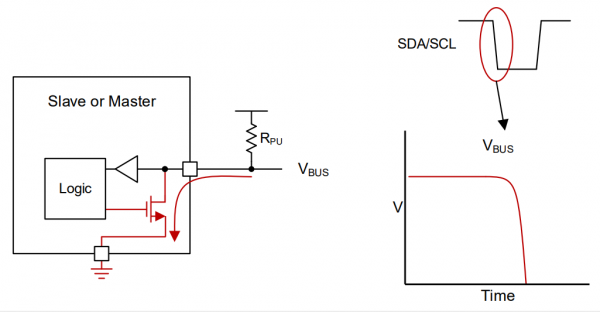
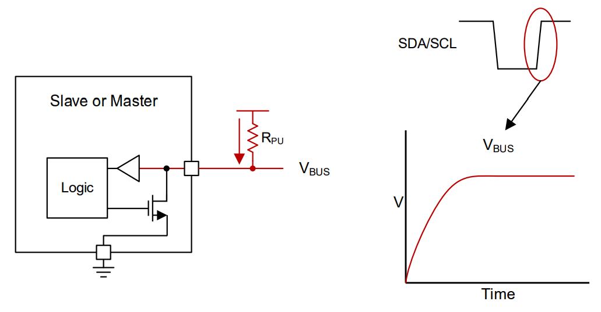

# I2C

## Topic: Understanding I2C Open Drain Interface

## Date: 01/09/2025 

---

### Cue Column (Questions, Keywords, or Prompts)
- Still unclear about functionality of Open Drain for preventing short circuit? How can it do that?

---

### Notes Section (Main Notes)

**1. Open-drain - Bidirectional Communication**
- Open drain means all devices are using a MOSFET with open drain (not connected to anywhere else) to drive the bus voltage. This technique ensures easy bidirectional communication among multiple devices without any conflicts which may cause short circuit/excess currents if we connect in normal ways.
- Thus the bus line may be pulled down to GROUND voltage if any of the MOSFET in a I2C device is ON or release the bus line and let it be pulled up by the pull up resistor.
- All the I2C interfaces use open drain for bot SCL and SDA lines to avoid **a short circuit.**
- It is possible that at the same time for multiple masters to transmit one and zero. If one of the masters transmit one and another transmits zero on the same SDA line, we will have one and zero. Hence, that will create a short circuit.
- So, to avoid this, I2C uses an **open drain interface**.
- Open drain basically means the master or slave could either pull the line low or it could release the line. So when the master or slave pulls the line low, we get zero on SDA and when the master or slave releases the line, we get one (because of the pull-up resistor that is present on both SDA and SCL lines)

    

**How we pull low or release the line in an I2C interface**
- Following the image, in a few devices, we use a pull-down FET to pull our line low, and then we have the pull-up resistor. The typical values of pull-up.
- The typical values of pull-up resistors that we use in an I2C interface range from 2K to 10K
- The pull-down FET may not be present in an FPGA. So that we may need to modify our code such that we pull the line low. We'll understand how we do

**Open Drain - Pulling Low**

- When the device needs to transmit LOW, it can switch ON the MOSFET, the bus will be pulled down (shorted to ground).

**Open Drain - Releasing Bus**

- When a device needs to transmit HIGH, it can simply release the bus (MOSFET OFF). This leaves the bus floating and it will be pulled HIGH by the pull up resistors.

---

### Summary Section (Summary of Notes)
