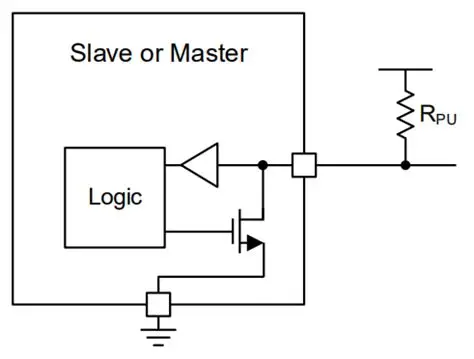

# I2C

## Topic: Understanding I2C Open Drain Interface

## Date: 01/09/2025 

---

### Cue Column (Questions, Keywords, or Prompts)

---

### Notes Section (Main Notes)

**1. Open-drain**

- All the I2C interfaces use open drain for bot SCL and SDA lines to avoid a short circuit.
- It is possible that at the same time for multiple masters to transmit one and zero. If one of the masters transmit one and another transmits zero on the same SDA line, we will have one and zero. Hence, that will create a short circuit.
- So, to avoid this, I2C uses an open drain interface.
- Open drain basically means the master or slave could either pull the line low or it could release the line. So when the master or slave pulls the line low, we get zero on SDA and when the master or slave releases the line, we get one (because of the pull-up resistor that is present on both SDA and SCL lines)

    

---

### Summary Section (Summary of Notes)
