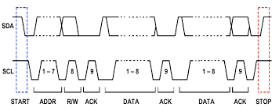

# I2C

## Topic: I2C Write and Read Transactions

## Date: 23/09/2025 

---

### Cue Column (Questions, Keywords, or Prompts)

---

### Notes Section (Main Notes)

Key points include the 7-bit address space, which can be extended to 10 bits when interacting with newer sensors. The R/W (Read/Write) bit is highlighted as a critical element, indicating whether the operation is a read or write action.

**Writing Data:**

- The master device initiates communication by sending a start condition.
- This is followed by transmitting the slave address along with the R/W bit.
- Once the slave device receives the address, it acknowledges by pulling the SDA (Serial DataLine) low, indicating that it is ready to communicate.
- If the slave does not acknowledge, this indicates an issue, leading the master to send astop condition and potentially restart the communication process.
Upon successful acknowledgment, the master then sends the data to the slave, who must alsoacknowledge this transfer.
- If multiple registers are involved in the communication, the master sends the relevantregister address right after the initial acknowledgment.

**Reading Data:**

- The read process starts similarly, with the master sending a start condition, followed by a read command (indicated by a '1') and the slave address.
- After the slave acknowledges receipt, it begins transmitting the requested data back to the master.
- The master can end the read operation by sending a negative acknowledgment when it no longer requires additional data, followed by a stop condition to conclude the session.

---

### Summary Section (Summary of Notes)
